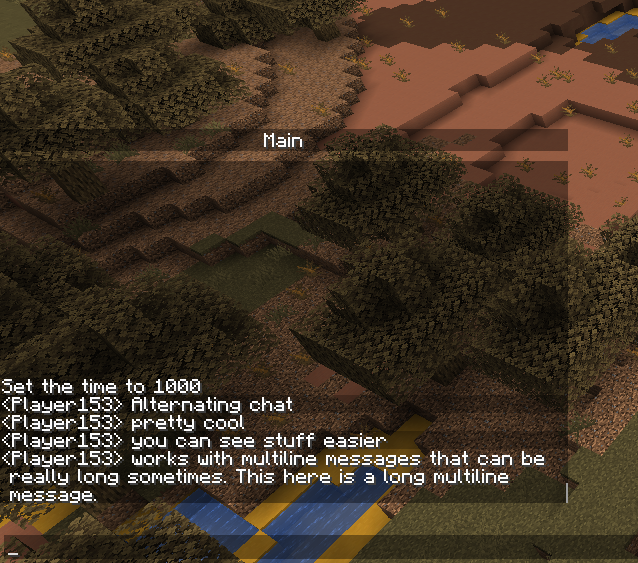
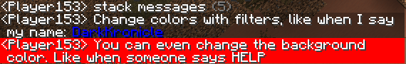
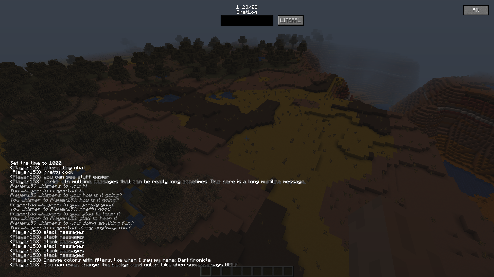
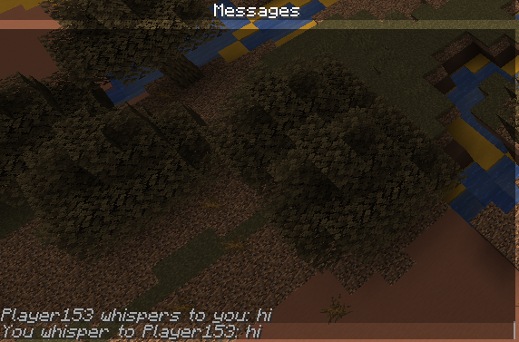

# AdvancedChat

A Minecraft mod designed to give the client more customizability over the vanilla chat.

**IMPORTANT AdvancedChat is being split up and this repository will be archived soon. Check out AdvancedChatCore and the discord for more information.**

## Features

- Change colors
    - Background of the Chat Hud
    - Blank text
    - Have the messages in chat hud be striped (alternates between lighter and darker backgrounds between messages)
- Advanced Search
    - Use Regular Expressions
    - Case Sensitive or Insensitive
    - Pass forward to children filters for more control
- Chat Tabs
    - Sections of chat that can store specific messages that matches an advanced search
    - Have a preset prefix to start chat when you open up chat in the specified tab
    - Block messages from going into the main chat tab
- Chat Filters
    - Replace an advanced search with specified text
    - Change the color of the match
    - Change the background color of the match
    - Play a sound when a match is found
    - Replace the full message
    - Rainbow specific text
    - Convert specific text to OwO
- Chat Log Screen
    - Stores up to 5000 messages
    - Can filter out using a search box
    - Show customized chat tabs
    - Customized Keybind to open it
- Show time when messages are posted
    - Customize the format on how they display
    - Customize the color
- Change chat hud visibility
    - Have the hud display behave like vanilla
    - Have the hud display at all times
    - Have the hud only display when chat is focused
- Stack messages
    - Stack only up to the last message
    - Stack up to 20 messages back
- Chat Tabs
- Built in developer API
- More features soon to come!

*This mod is still in development and will have improvements and changes over time. To help contribute, please submit all bugs and feature requests to the [bug tracker!](https://github.com/DarkKronicle/AdvancedChat/issues)*

## Screenshots

This isn't all the features, so try it out for yourself!

## What do all the branches and versioning mean?

- v3 - *Master branch, all work goes here.*
- v2 - *Second main version, also bad code*
- v2-1.15 - *Back port of the v2 branch*
- v1 - *First version of AdvancedChat. Old and bad code.*

## How to build?

Build it like other Fabric mods. Run `./gradlew build` to have gradle build the source. You'll need to put [suggester-basic/lib/suggester-1.1.2.jar](http://www.softcorporation.com/products/suggester/) in `./lib/suggester-1.1.2.jar` as well as `english.jar` in `./lib/english.jar`

## Credits and other

Code & Mastermind: DarkKronicle

Update to 1.16.3: lmichaelis

Logo & Proofreading: Chronos22

SpellChecking Algoirthm: [SoftCorporationLLC](http://www.softcorporation.com/products/suggester/)

Idea of Chat Heads: [dzwdz](https://github.com/dzwdz/chat_heads/blob/fabric-1.16.x/)

Original Idea of OwOing chat: [hewo](https://github.com/Arc-blroth/hewo)

If you notice any bugs, please report to the [bug tracker!](https://github.com/DarkKronicle/AdvancedChat/issues)

For more help join the [Discord](https://discord.gg/WnaE3uZxDA)
