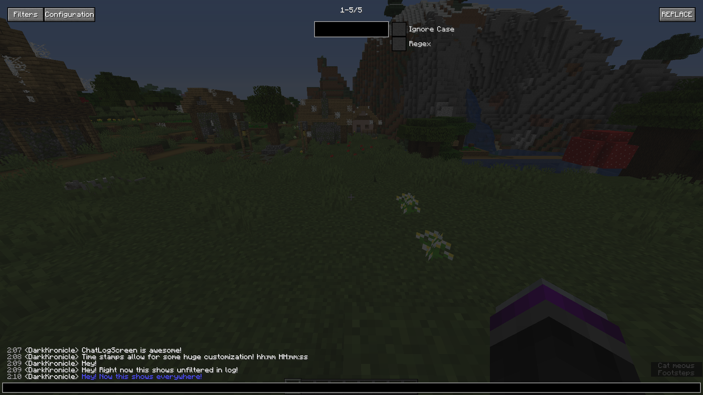
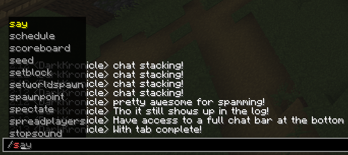
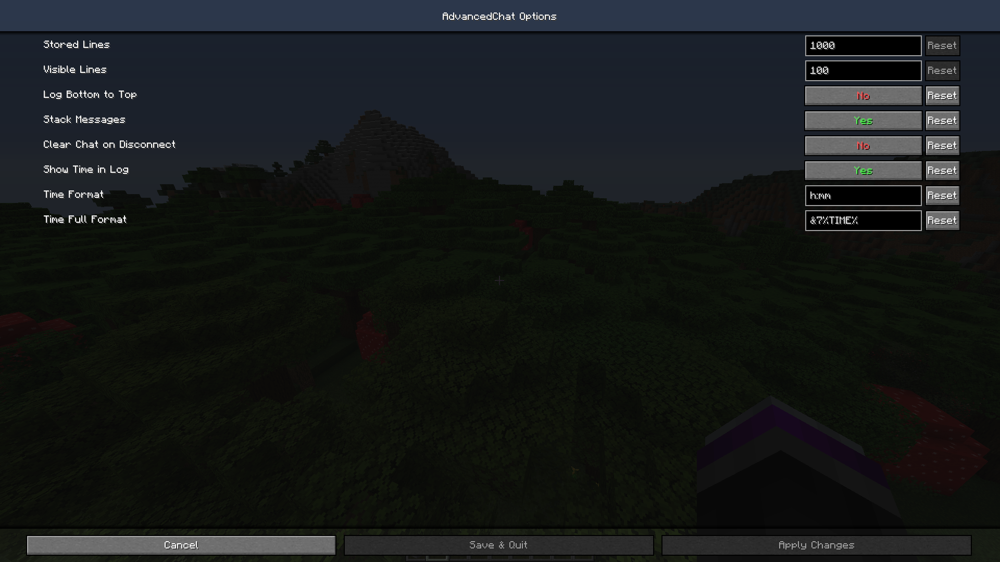
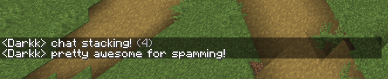
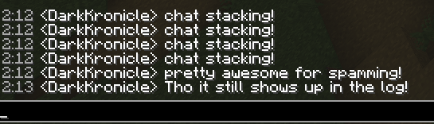
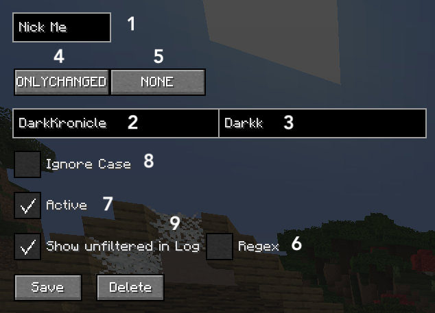
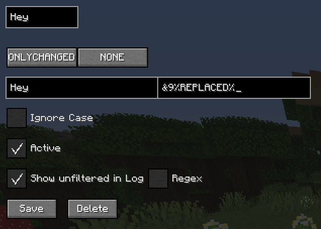
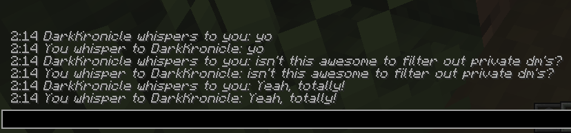
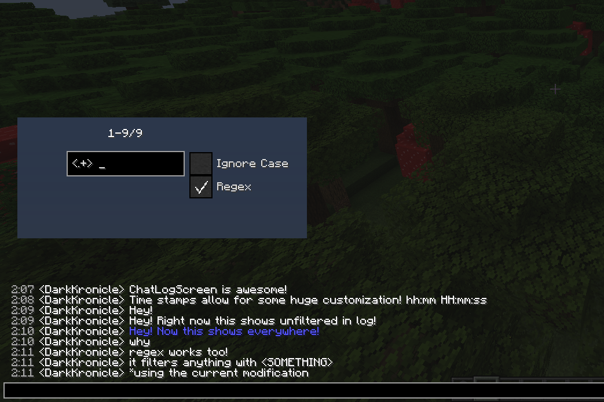

# AdvancedChat

A plugin designed to give the user more control over Minecrafts built in chat.

The plugin has filters that are customizable, as well as a screen to view up to 5000 lines of chat.

## Features

- ChatLogScreen that is easily accessible from the chat screen.
    - You can view up to 5000 lines of chat.
    - Regex filtering of messages.
    - Access the main configs.
- Filters that can change messages, and notify you.
    - Each filter is equipped with several options to give you customization.
    - Further advanced features with regex and chat formatting.
    
*ChatLogScreen*

*Lots of configurations!*

*Chat Stacking!*

## Filters

Filters are little modules that view each chat message and react to it differently. In the filter config screen you have some configuration options:

 
 
 1. Filter Name
 2. What the filter looks for
 3. What the filter can replace the message for.
 4. If the filter should replace the full message, or just what is changed.
 5. If the filter should notify you or move message to top of the screen.
 6. If Regex should be used to find matches. 
 7. Whether it's active.
 8. Whether it should ignore case if Regex is off.
 9. Whether it should show an unchanged version inside ChatLogScreen.
 
 If you replace anything, either ONLYCHANGED or FULLLINE, you have the option to reuse what was replaced. Here's an example of that!
 
 
 
 
 
 You can also block the full line and replace it with whatever!
 
 
 
## Screenshots

## Credits and other

Code: DarkKronicle

Logo: Chronos22Gamer

If you notice any bugs, please report to the bug tracker!